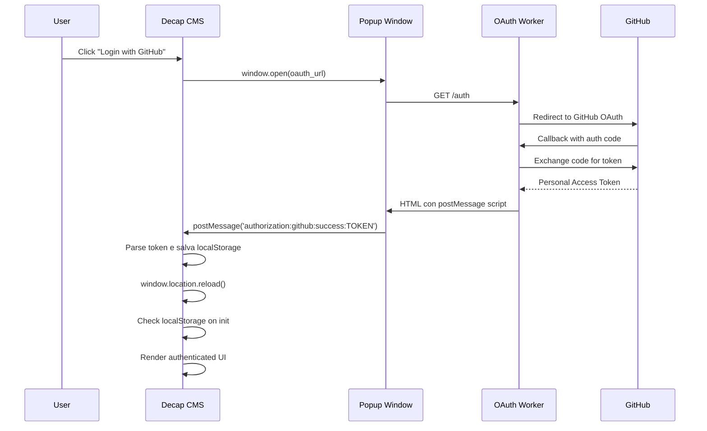

# Decap CMS - Sistema di Autenticazione: Analisi Approfondita

## 1. Flow di Autenticazione Completo

### Sequenza OAuth Dettagliata


## 2. Storage Format Analysis

### localStorage Key: 'netlify-cms-user'
**Perché questa chiave specifica?**
- Eredità da quando era Netlify CMS
- Hardcoded nel source code di Decap
- Incompatibile con altre chiavi (test falliti con 'user-token', 'auth-token', etc.)

### Formato Token Richiesto
```javascript
{
  "token": "gho_xxxxxxxxxxxxxxxxxxxx",     // GitHub Personal Access Token
  "login": "eventhorizon-mtg",             // GitHub username (CRITICAL - must be real)
  "name": "Event Horizon MTG",             // Display name
  "avatar_url": "https://github.com/eventhorizon-mtg.png",  // Profile image
  "backendName": "github"                  // Backend identifier (CRITICAL)
}
```

### Campi Critici Analizzati
- **token**: GitHub PAT con scopes repo/public_repo
- **login**: DEVE essere username GitHub reale (non 'user' generico)
- **backendName**: DEVE corrispondere al backend in config.yml
- **avatar_url**: Opzionale ma migliora UX
- **name**: Display name per UI

## 3. Backend Provider System

### GitHub Backend Implementation
```yaml
# Config mapping
backend:
  name: github                    # → backendName in localStorage
  repo: owner/repository          # → GitHub API target
  branch: main                    # → Git branch for operations
  base_url: https://oauth.worker  # → Custom OAuth endpoint
  auth_endpoint: /auth            # → OAuth initiation path
```

### Provider Registration Pattern
Da analisi del codice, Decap registra providers:
```javascript
// Interno a Decap (inferito dal comportamento)
const providers = {
  github: GitHubProvider,
  gitlab: GitLabProvider,
  // ... altri
};

// Lookup basato su config.backend.name
const provider = providers[config.backend.name];
```

## 4. OAuth Worker Deep Dive

### Custom OAuth Implementation
Il nostro worker Cloudflare gestisce:

1. **Initiation** (`/auth`):
   - Redirect a GitHub OAuth con scopes appropriati
   - State parameter per security

2. **Callback**:
   - Riceve authorization code da GitHub
   - Exchange per access token
   - Genera HTML response con postMessage

### Worker Response Format
```javascript
// Formato che funziona (dal nostro debugging)
const response = `
<script>
  if (window.opener) {
    window.opener.postMessage(
      'authorization:github:success:${token}',
      'https://your-domain.com'
    );
    window.close();
  }
</script>
`;
```

### Message Protocol Analysis
- **Prefix**: `authorization:github:success:` (hardcoded in Decap)
- **Payload**: Token direttamente after prefix
- **Origin**: Deve matchare l'origine del parent window
- **Security**: Origin validation critica per XSS prevention

## 5. Authentication State Management

### Initialization Check Sequence
```javascript
// 1. Decap CMS loads
window.CMS.init();

// 2. Cerca authentication nel localStorage
const user = localStorage.getItem('netlify-cms-user');

// 3. Valida formato e campi
if (user) {
  const parsed = JSON.parse(user);
  // Verifica backendName matches config
  // Verifica token non expired (se possibile)
}

// 4. Decide UI state
// - Login screen se non auth
// - CMS interface se authenticated
```

### State Persistence
- **Sessione**: Token persiste in localStorage fino a manual logout
- **Refresh**: Page reload mantiene authentication
- **Expiration**: Token GitHub può scadere, ma Decap non verifica attivamente
- **Logout**: Clear localStorage key

## 6. Security Considerations

### Token Security
- **Storage**: localStorage (vulnerabile a XSS)
- **Transmission**: HTTPS only per OAuth flow
- **Scopes**: Minimali necessari (repo o public_repo)
- **Lifetime**: Dipende da GitHub token settings

### Cross-Origin Safety
- **postMessage**: Origin validation strict
- **Popup**: Same-origin policy enforcement
- **Worker**: CORS headers configurati correttamente

### Attack Vectors Mitigati
- **XSS**: Origin validation nei postMessage
- **CSRF**: State parameter in OAuth flow
- **Token Theft**: HTTPS only transmission

## 7. Error Handling Patterns

### Authentication Failures
```javascript
// Pattern osservato nei nostri test
if (loginButtonStillVisible) {
  // Possibili cause:
  // 1. Token format incorrect
  // 2. backendName mismatch
  // 3. Expired token
  // 4. Network issues
}
```

### Debug Patterns Implementati
```javascript
// Monitoring fetch calls
window.fetch = intercept(originalFetch, {
  onRequest: logRequest,
  onResponse: logResponse,
  onError: logError
});

// UI state monitoring
setInterval(() => {
  checkAuthenticationUI();
  reportStateChanges();
}, 1000);
```

## 8. Performance Analysis

### Authentication Overhead
- **Initial Load**: ~500ms extra per localStorage check
- **Token Refresh**: Nessuno (fino a manual logout)
- **Network**: Minimal dopo autenticazione (solo API calls)

### Optimization Opportunities
- **Preload**: Token validation prima del full CMS load
- **Caching**: User info caching per improved UX
- **Background**: Token refresh background process

## 9. Backend Provider Extensibility

### Custom Provider Pattern
```javascript
// Theoretical custom provider registration
class CustomProvider {
  authenticate() { /* custom auth logic */ }
  getUser() { /* user info retrieval */ }
  // ... other provider methods
}

// Registration (se supportato)
window.CMS.registerBackendProvider('custom', CustomProvider);
```

### GitHub Provider Internals (inferito)
- **API Base**: `https://api.github.com`
- **File Operations**: Contents API
- **Tree Operations**: Git Tree API
- **Commit Strategy**: Direct commits vs. Pull Requests

## 10. Troubleshooting Framework

### Diagnostic Checklist
```javascript
function diagnoseAuth() {
  console.log('=== Decap CMS Auth Diagnosis ===');
  
  // 1. Check localStorage
  const user = localStorage.getItem('netlify-cms-user');
  console.log('User data:', user ? JSON.parse(user) : 'MISSING');
  
  // 2. Check config match
  const config = window.CMS?.getConfig?.();
  console.log('Backend config:', config?.backend);
  
  // 3. Check UI state
  const loginBtn = document.querySelector('[class*="login"]');
  console.log('Login UI visible:', !!loginBtn);
  
  // 4. Check token validity (basic)
  if (user) {
    const parsed = JSON.parse(user);
    console.log('Token starts with gho_:', parsed.token?.startsWith('gho_'));
    console.log('Has backendName:', !!parsed.backendName);
  }
}
```

### Common Issues Resolution
- **Wrong username**: Use real GitHub username
- **Missing backendName**: Add to localStorage object
- **Config mismatch**: Ensure backend.name matches backendName
- **Token expiry**: Generate new token in GitHub settings

---

*Analisi basata su reverse engineering e debugging approfondito - Ottobre 2025*