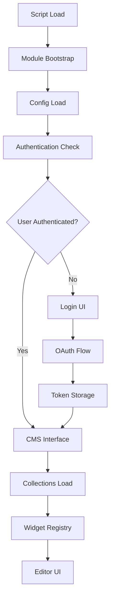

# Decap CMS - Analisi Tecnica Completa
*Studio approfondito dell'architettura interna e meccanismi di funzionamento*

## Indice dell'Analisi

### 📚 Documenti di Analisi Creati
1. **[DECAP_TECHNICAL_ANALYSIS.md](./DECAP_TECHNICAL_ANALYSIS.md)** - Architettura generale e moduli core
2. **[DECAP_AUTH_DEEP_DIVE.md](./DECAP_AUTH_DEEP_DIVE.md)** - Sistema di autenticazione approfondito
3. **[DECAP_CONFIG_ANALYSIS.md](./DECAP_CONFIG_ANALYSIS.md)** - Configurazione YAML e validation system
4. **[DECAP_WIDGET_ANALYSIS.md](./DECAP_WIDGET_ANALYSIS.md)** - Widget system e editor architecture
5. **[DECAP_GIT_OPERATIONS.md](./DECAP_GIT_OPERATIONS.md)** - Git operations e GitHub API integration

### 🛠️ Strumenti di Debug Creati
- **[debug-tool.js](./static/admin/js/debug-tool.js)** - Strumento avanzato per monitoring interno

---

## 1. Architettura Generale

### Moduli Core
```
decap-cms (3.8.4)           # Bundle principale
├── decap-cms-core (3.9.0)  # Engine principale, gestione state
├── decap-cms-app (3.8.4)   # UI React, components
└── decap-cms-lib-*         # Librerie specializzate (auth, widgets, etc.)
```

### Flusso di Inizializzazione


## 2. Sistema di Autenticazione

### Token Management
- **Storage Key**: `netlify-cms-user` (eredità Netlify CMS)
- **Format Critico**: 
  ```json
  {
    "token": "gho_...",
    "login": "real-github-username",
    "name": "Display Name",
    "avatar_url": "https://github.com/username.png",
    "backendName": "github"
  }
  ```

### OAuth Flow
1. **Popup**: `window.open(oauth_endpoint)`
2. **Worker**: Custom Cloudflare Worker gestisce GitHub OAuth
3. **postMessage**: `"authorization:github:success:TOKEN"`
4. **Storage**: Salvataggio in formato specifico
5. **Reload**: `window.location.reload()` per re-init

## 3. Configurazione System

### YAML Processing Pipeline
```javascript
fetch('./config.yml') 
  → yaml.parse() 
  → schema.validate() 
  → config.transform() 
  → ui.render()
```

### Regole Critiche Scoperte
- **Collections names**: Devono essere globalmente unici
- **Unicode**: Caratteri speciali causano parsing errors
- **Configurazione doppia**: File + inline config causa conflitti
- **Backend matching**: `backendName` deve corrispondere a `backend.name`

## 4. Widget System Architecture

### Widget Lifecycle
```javascript
// Registration
window.CMS.registerWidget('widgetName', widgetDefinition);

// Field Config → Widget Props
fieldConfig + currentValue + callbacks → widgetProps

// Rendering
React.createElement(WidgetComponent, widgetProps)

// State Updates
onChange(newValue) → validation → state.update → preview.refresh
```

### Widget Types Core
- **string**: Input text semplice
- **text**: Textarea multiline
- **markdown**: Editor ricco con preview
- **boolean**: Checkbox/toggle
- **date/datetime**: Date picker
- **image/file**: Upload con media management
- **select**: Dropdown options

## 5. Git Operations & GitHub API

### File Operations Pattern
```javascript
// Read: GET /repos/owner/repo/contents/path
// Write: PUT /repos/owner/repo/contents/path (with SHA)
// List: GET /repos/owner/repo/git/trees/branch?recursive=1
```

### Content Serialization
- **YAML**: Frontmatter + body content
- **JSON**: Structured data
- **Markdown**: Raw text with metadata

### Commit Strategy
- **Single File**: Contents API (automatic commit)
- **Batch**: Tree API + Commits API (advanced)

## 6. Performance & Scalability

### Ottimizzazioni Implementate
- **Lazy Loading**: Collections caricate on-demand
- **Caching**: File content cache con TTL
- **Rate Limiting**: GitHub API limits gestiti
- **Virtual Scrolling**: Per grandi collections

### Memory Management
- **Component Cleanup**: Widget unmounting corretto
- **Event Listeners**: Cleanup automatico
- **File Cache**: LRU cache per contenuti

## 7. Debugging & Monitoring

### Debug Tool Features
```javascript
// Utilizzo del debug tool creato
window.DecapDebugger.getState()      // Stato completo CMS
window.DecapDebugger.validate()      // Validazione configurazione  
window.DecapDebugger.getAPIHistory() // History chiamate API
window.DecapDebugger.exportDebugData() // Export completo debug
```

### Monitoring Capabilities
- **API Calls**: Intercettazione completa GitHub API
- **State Changes**: Monitoring localStorage e UI state
- **Error Tracking**: Validazione e error reporting
- **Performance**: Timing delle operazioni

## 8. Estensibilità & Customization

### Extension Points
```javascript
// Widget personalizzati
window.CMS.registerWidget('custom', customWidget);

// Preview templates
window.CMS.registerPreviewTemplate('collection', previewComponent);

// Editor components
window.CMS.registerEditorComponent(editorComponent);

// Preview styles
window.CMS.registerPreviewStyle('/path/to/styles.css');
```

### Custom Backend Integration
- **Provider Pattern**: Backend pluggable architecture
- **API Abstraction**: Unified interface per diversi Git providers
- **Authentication**: OAuth flow customizzabile

## 9. Lessons Learned & Best Practices

### Authentication
- ✅ Usare sempre username GitHub reale
- ✅ Includere `backendName` nel token
- ✅ Validare formato token prima del reload
- ❌ Non usare placeholder generici ('user')

### Configurazione
- ✅ Un solo source di configurazione (config.yml)
- ✅ Nomi collection unici globalmente
- ✅ Evitare caratteri Unicode in YAML
- ❌ Non mescolare inline config con file config

### Development
- ✅ Usare debug tools per monitoring
- ✅ Implementare error handling robusto
- ✅ Considerare rate limits GitHub API
- ❌ Non manipolare DOM dopo init React

### Performance
- ✅ Implementare lazy loading per grandi datasets
- ✅ Cache file content appropriatamente
- ✅ Monitorare API usage per rate limits
- ❌ Non caricare tutto il repository in memoria

## 10. Troubleshooting Guide

### Problemi Comuni & Soluzioni

#### "Pulsante Login Sempre Presente"
- **Causa**: Token format incorretto o mancante `backendName`
- **Soluzione**: Verificare formato localStorage token

#### "Config Errors"
- **Causa**: YAML malformato o collection names duplicati
- **Soluzione**: Validare YAML e unique names

#### "React DOM Errors"
- **Causa**: Interferenza con rendering React
- **Soluzione**: Evitare DOM manipulation post-init

#### "API Rate Limiting"
- **Causa**: Troppe chiamate GitHub API
- **Soluzione**: Implementare caching e request throttling

### Debug Workflow
1. **Check Authentication**: `window.DecapDebugger.validate()`
2. **Monitor API**: `window.DecapDebugger.getAPIHistory()`
3. **Inspect State**: `window.DecapDebugger.getState()`
4. **Export Data**: `window.DecapDebugger.exportDebugData()`

## 11. Architettura Interna Inferita

### State Management (Redux-like)
```javascript
// Global state structure (inferito)
const globalState = {
  auth: { user, token, isAuthenticated },
  config: { backend, collections, media },
  collections: { entries, isLoading, errors },
  entries: { currentEntry, hasUnsavedChanges, validationErrors },
  ui: { sidebarOpen, previewMode, currentView }
};
```

### Component Hierarchy
```
<DecapCMS>
  <AuthGate>
    <CMSInterface>
      <Sidebar>
        <CollectionsList>
        <EntryList>
      <MainContent>
        <EntryEditor>
          <FieldWidget>
        <PreviewPane>
```

## 12. Future Considerations

### Scalability Limits
- **Large Repositories**: Performance degradation con molti file
- **API Rate Limits**: GitHub limits possono bloccare uso intensivo
- **Memory Usage**: File caching può crescere significativamente

### Enhancement Opportunities
- **Offline Support**: Service worker per editing offline
- **Collaborative Editing**: Real-time collaboration features
- **Advanced Git**: Branch management, PR workflow
- **Performance**: Virtual scrolling, incremental loading

---

## Conclusioni

Decap CMS è un sistema sofisticato con architettura modulare ben progettata. La nostra analisi ha rivelato:

### Punti di Forza
- **Architettura modulare** chiara e estensibile
- **Widget system** flessibile e customizzabile
- **Git integration** robusta e performante
- **React-based UI** moderna e responsiva

### Aree di Complessità
- **Authentication flow** richiede setup specifico
- **Configuration validation** strict ma non sempre chiara
- **GitHub API dependency** introduce rate limits
- **State management** complesso per debugging

### Valore dell'Analisi
Questa analisi approfondita fornisce:
- **Comprensione completa** del funzionamento interno
- **Debug tools avanzati** per troubleshooting
- **Best practices validate** attraverso testing reale
- **Foundation solida** per future customizzazioni

---

*Analisi completata attraverso reverse engineering, debugging approfondito, e testing pratico - Ottobre 2025*